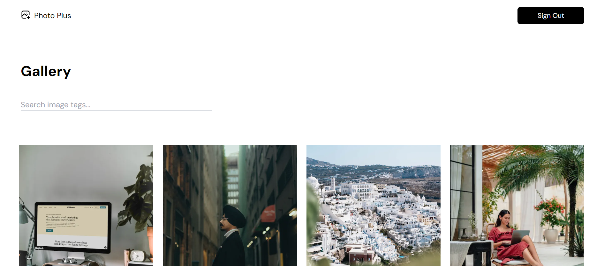

# Image Draggable Gallery



<br/>

The Image Draggable Gallery is a web application that allows users to create and interact with draggable image galleries. It provides a user-friendly interface for managing and viewing a collection of images. This README will guide you through the process of setting up and using the application.

## Table of Contents

- [Getting Started](#getting-started)
  - [Prerequisites](#prerequisites)
  - [Installation](#installation)
  - [Firebase Configuration](#firebase-configuration)
- [Usage](#usage)
- [Features](#features)
- [Tech Stack](#tech-stack)

## Getting Started

### Login information

- email: user@example.com
- password: 1Password

These instructions will help you set up the Image Draggable Gallery on your local machine.

### Prerequisites

Before you begin, make sure you have the following installed:

- [Node.js](https://nodejs.org/)
- [npm](https://www.npmjs.com/)

### Installation

1. Clone the repository to your local machine:

   ```bash
   git clone https://github.com/Tk-brainCodes/HNGx-Task-3.git
   ```

2. Change directory
   ```bash
   cd HNGx-Task-3/image-draggable-gallery
   ```

3. Install the project dependencies:
   ```bash
    npm install
   ```   
4. Add your firebase configuration
   ```bash
    const firebaseConfig = {
    apiKey: "YOUR_API_KEY",
    authDomain: "YOUR_AUTH_DOMAIN",
    projectId: "YOUR_PROJECT_ID",
    storageBucket: "YOUR_STORAGE_BUCKET",
    messagingSenderId: "YOUR_MESSAGING_SENDER_ID",
    appId: "YOUR_APP_ID"
    };
    ```

5. Start the server
    ```bash
    npm start
    ```   

6. Tech Stack
-  Next js and Typescript
-  Tailwind Css
-  Firebase    
